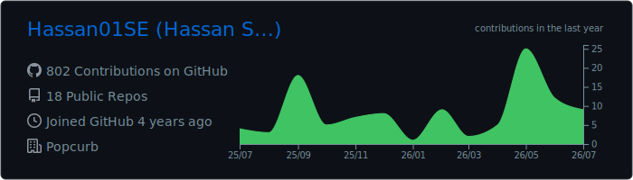
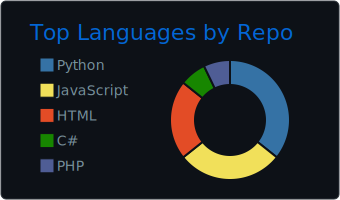
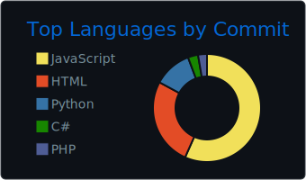
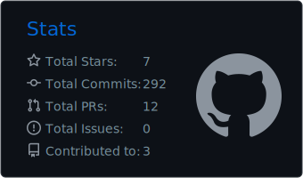
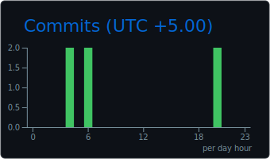

  
    

    

  
    

  <h1>Hi, I'm Hassan Sohail 👋</h1>

  <h3>Software Engineer | Full-Stack Development | Backend Systems | Cloud | IoT Integrations</h3>

  

    I build full-stack web platforms, backend services, dashboards, cloud-deployed applications, and real-time integrations.
  

  
  
  
  
  

---

## About Me

I am a Software Engineer with experience across frontend development, backend systems, databases, cloud deployment, IoT communication, and payment integrations.

Currently, I work on production software involving scalable APIs, admin dashboards, real-time MQTT communication, Azure services, and third-party payment workflows.

* Software Engineering graduate from **NED University of Engineering & Technology**
* Experienced with **React, Next.js, TypeScript, Django REST Framework, Node.js, PostgreSQL, MongoDB, and Azure**
* Worked with **MQTT**, webhooks, cloud-hosted APIs, and payment integrations
* Interested in scalable software systems, backend architecture, applied AI, cloud engineering, and clean developer workflows
* I also write technical articles on Medium about backend development, cloud storage, and integrations

---

## Tech Stack

### Frontend

### Backend

### Databases, Cloud & Tools

---

## Certifications

* **Meta Full-Stack Engineer Certificate** — Coursera / Meta
* **Meta Back-End Developer Professional Certificate** — Coursera / Meta
* **Meta Front-End Developer Professional Certificate** — Coursera / Meta

---

## Technical Writing

I write about backend development, cloud storage, MQTT integrations, and full-stack engineering.

---

## Current Focus

* Building production-grade full-stack applications
* Improving backend architecture and API design
* Working with cloud deployments and real-time systems
* Learning deeper system design, DevOps, and AI-assisted development workflows

---

  <i>Clean code, reliable systems, and thoughtful user experiences.</i>

## GitHub Insights

  

  
  

  
  

